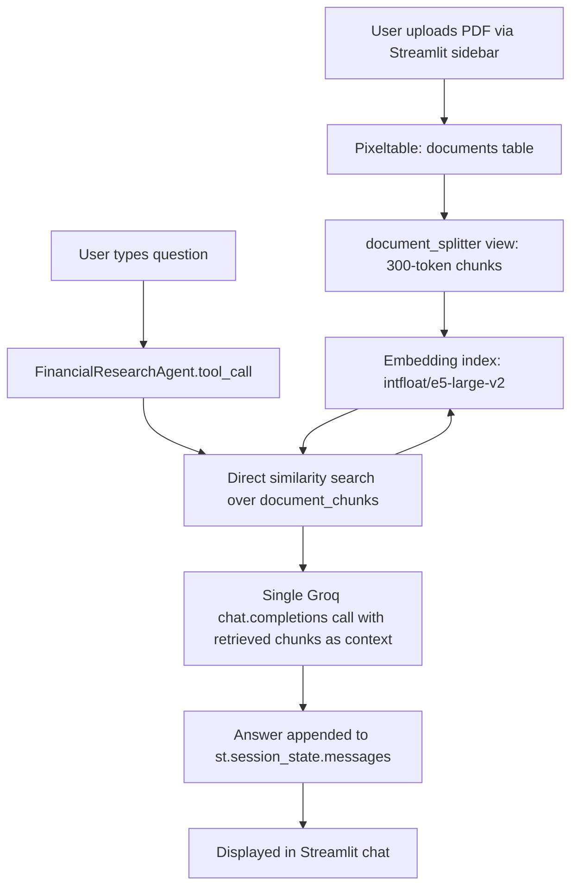

# PRD — Financial Research Assistant (Equity Research Agent)

**Repo:** `context-pipeline`
**Status:** Functional prototype, stabilized
**Owner:** Anshul
**Last updated:** September 2026

---

## 1. Overview

Financial Research Assistant is a retrieval-augmented generation (RAG) chatbot that lets a user upload financial reports (PDFs — 10-Ks, earnings transcripts, equity research notes) and ask natural-language questions about their contents. The app retrieves the most relevant chunks of the uploaded document via semantic search and grounds an LLM's answer strictly in that retrieved context, rather than the model's general knowledge.

It's built as a single-user local tool: a Streamlit front end backed by Pixeltable as an embedded vector database and orchestration layer, with Groq hosting the LLM.

## 2. Problem Statement

Manually searching long financial PDFs for specific assumptions (growth rates, WACC, margin drivers, guidance commentary) is slow. Equity research and FP&A work frequently requires pulling precise, sourced figures from dense documents. A chat interface that answers *only* from the uploaded document — and says so explicitly when it can't — removes that manual search step while staying auditable.

## 3. Goals

- Let a user drop in a financial PDF and start asking questions within seconds, with no manual chunking or embedding step.
- Ground every answer in retrieved document chunks — not the model's parametric knowledge — to avoid hallucinated figures.
- Persist conversation history so follow-up questions have context.
- Run entirely locally (embedded Postgres via Pixeltable, no external vector DB service required) so it's easy to clone and run.

### Non-Goals

- Multi-document comparison / cross-referencing in a single session (current retrieval pool is shared across all ingested documents — see §8).
- Multi-user / concurrent-session support.
- Structured financial modeling (this is a Q&A layer over documents, not a spreadsheet/model builder).

## 4. Target User

Primary: the project owner, for personal equity research workflows. Secondary/portfolio use: demonstrates a working RAG pipeline combining a vector DB, an agent framework, and a hosted LLM — relevant for FP&A / data analyst roles that touch LLM tooling.

## 5. System Architecture

This is what `app.py` actually runs in production. See §5.1 for how it differs from the notebook prototype.



`app.py`'s `FinancialResearchAgent.tool_call()` (`app.py:42-72`) queries `context_engineering.document_chunks` directly and makes one Groq call with the top-3 chunks — no agent framework, no tool-calling round trip. Conversation history lives in `st.session_state.messages`: per-browser-session only, lost on app restart or page refresh, never written to Pixeltable.

### 5.1 Prototype vs. product: why `app.py` doesn't match `pipeline.ipynb`

`pipeline.ipynb` was the original build-and-validate path, and it uses a different, heavier design: `pixelagent.openai.Agent` (cell 15) running a two-stage tool-calling pipeline (`find_documents` tool → Groq → tool result → Groq again), with responses persisted to a Pixeltable `agent.memory` table and a separate embedding index built over that memory (cell 17), which is then exported to LanceDB and searched with a hand-rolled cosine-similarity function (cells 19–21) purely as an exploratory demo.

That prototype proved the retrieval-and-grounding concept worked — its one real test query returned a correctly grounded, sourced answer about Alphabet's Q1 2024 earnings (EPS, revenue, market cap) pulled straight from the ingested `Company-Research-Alphabet.pdf`. But it surfaced two problems that `pixelagent`'s pipeline made hard to fix from the outside:

1. **Recursive tool-call / write-lock failures** — `pixelagent`'s `tool_call()` runs as a single Pixeltable insert chaining two Groq calls plus tool execution as computed columns; a same-process retry around it triggered overlapping transactions and hung (§8.1).
2. **Opaque, occasionally very slow, multi-call latency** — the notebook's own execution log shows one `memory` table insert taking **921 seconds** (cell 15 output) between two inserts that took 0.01s each, with no logging inside the chain to say why.

`app.py` is a deliberate rewrite in response to both: it drops `pixelagent.Agent` for a single direct Groq call over a manually-run similarity query (`app.py:42-72`), trading the memory-table/LanceDB machinery for simple session-state history. The notebook's `pixelagent`/memory/LanceDB path still exists as a working exploratory demo — it is not dead code, but it is **not** what the shipped app runs, and `find_documents` (notebook) / `financial_tool` (`tools.py`) are two separate, redundant implementations of the same query that only the notebook's `find_documents` is actually wired to an agent.

**Two entry points, now genuinely different:**
- `pipeline.ipynb` — one-time schema setup and demo ingestion (still required before first run of `app.py`, since it creates `context_engineering.documents`/`document_chunks`/the embedding index), plus the `pixelagent`-based exploratory prototype described above.
- `app.py` — the actual product surface: a persistent Streamlit chat app running the simplified single-call design in the diagram above.

## 6. Tech Stack

| Layer | Choice |
|---|---|
| Architecture pattern | RAG (Retrieval-Augmented Generation) — answers are grounded in retrieved document chunks, not the model's parametric knowledge |
| Frontend | Streamlit |
| Vector DB / orchestration | Pixeltable (embedded Postgres via `pixeltable_pgserver`) |
| Agent framework | `pixelagent` (`pixelagent.openai.Agent`) — used only in `pipeline.ipynb`'s prototype (§5.1); `app.py` calls Groq directly with no agent framework |
| LLM | `openai/gpt-oss-120b`, served via Groq's OpenAI-compatible API |
| Embedding model | `intfloat/e5-large-v2`, sourced from the Hugging Face Hub, run locally via the `sentence-transformers` library |
| Model hub | Hugging Face Hub (embedding model weights only; runs offline after first download — see `HF_HUB_OFFLINE` in Known Limitations) |
| Chunking | Pixeltable `document_splitter`, token-based, 300-token limit |
| Secondary vector store (demo/export path only) | LanceDB, via `pxt.io.export_lancedb` |

## 7. Functional Requirements

| ID | Requirement |
|---|---|
| FR1 | User can upload a PDF via the sidebar; it is ingested into `context_engineering.documents` and chunked/embedded automatically. |
| FR2 | Re-uploading an already-ingested file (by path) is *intended* to be a no-op, checked against the database via `documents_t.where(pdf == file_uri \| pdf == file_path)` (`app.py:90-95`) rather than session state. **Known to have failed in practice** — see §8.6. |
| FR3 | User can ask a free-text question in the chat input. |
| FR4 | The system retrieves the top-3 most semantically similar chunks and passes them to the LLM as grounding context. |
| FR5 | The LLM's answer is displayed in the chat; conversation history persists **only for the current browser session**, in `st.session_state.messages` (`app.py:111-117`). It is lost on app restart or page refresh, and is not written to Pixeltable — the `pixelagent`/`memory`-table persistence described in earlier designs exists only in `pipeline.ipynb`'s prototype (§5.1), not in the shipped app. |
| FR6 | If the model fails to produce a response (see §8), the user sees a clear, non-crashing fallback message and can simply re-ask. |

## 8. Known Limitations / Technical Debt

Documented honestly for future maintainers (including future-me):

1. **Intermittent empty-response failures.** `gpt-oss-120b` is a reasoning model; at `reasoning_effort: medium`, it occasionally returns `message.content = None` with only a populated `.reasoning` field — confirmed non-deterministic via direct API testing (identical prompts succeed most of the time). `app.py` handles this with a try/except around `agent.tool_call()` (`app.py:128-131`) that shows a fallback message rather than crashing. This was originally hit inside `pixelagent`'s pipeline, where a same-process retry loop was tried and reverted because it triggered overlapping Pixeltable transactions that produced an unresponsive hang (see #3 below) — that's the direct reason `app.py` no longer uses `pixelagent` for the product surface.
2. **Shared retrieval pool across all ingested documents.** Both `financial_tool` (`tools.py`, unused — see #6) and `FinancialResearchAgent.tool_call` (`app.py:43-50`, the one actually running) search the entire `document_chunks` view, which accumulates every PDF ever ingested — there is no per-session or per-document scoping yet. Multi-document sessions will return chunks from whichever document is most semantically similar, not necessarily the one most recently uploaded.
3. **`pixelagent`'s tool pipeline was opaque — resolved by dropping it from the app.** In the `pipeline.ipynb` prototype, `tool_call()` ran as a single Pixeltable insert chaining two sequential Groq calls plus tool execution as computed columns, with nothing logged until the entire chain finished. The notebook's own execution log shows the cost of that opacity directly: one `memory` table insert (cell 15) took **921 seconds** between two inserts that took 0.01s each, with no visibility into why. `app.py` replaces the whole pipeline with one direct, loggable Groq call (`app.py:66-72`) specifically to get observability and to make retries safe (#1). The `pixelagent` path still exists in the notebook as a working demo of the alternative design, not as dead code — it's just not what ships.
4. **Config changes require a table rebuild (notebook prototype only).** Because `add_computed_column(..., if_exists="ignore")` is used internally, changing `pixelagent`'s `chat_kwargs`/`tool_kwargs` (e.g. `max_tokens`, `reasoning_effort`) has no effect until the agent's tables are rebuilt once with `reset=True` — which also wipes conversation memory. Not applicable to `app.py`, which has no such tables.
5. **Local-only, single-user.** Embedded Postgres and local file paths (`./{filename}`) assume a single machine, single user, no concurrent access.
6. **Confirmed duplicate-ingestion bug.** FR2's dedup check failed in practice: `test.ipynb`'s cleanup script deleted **35 rows from `context_engineering.documents`, i.e. the 2 demo docs plus 33 duplicate re-ingestions** of the same file(s) (see its own comment). Root cause not yet isolated — candidates are a URI/path mismatch in the `documents_t.where(...)` check (`app.py:90-95`) or repeated Streamlit reruns re-triggering the upload branch before `st.session_state.ingested_file` is set. `test.ipynb` is a one-off manual fix (`documents_t.delete()`), not an automated safeguard — the underlying bug is still open.
7. **One-time embedding/index cold-start cost is unmeasured and undocumented in the UI.** Beyond the 921s spike in #3, the first `sentence_transformer` load in any fresh process pays a real, user-visible cost (weight loading + index construction) that the Streamlit spinner text ("Analyzing semantic memory...") doesn't distinguish from a normal query. Not yet benchmarked separately from steady-state query latency (see success metric in §13).
8. **`tools.py`'s `financial_tool` is unused and imports eagerly.** `app.py:13` imports it but never calls it (retrieval is reimplemented inline in `FinancialResearchAgent.tool_call`). `tools.py:9` calls `pxt.get_table("context_engineering.document_chunks")` at module import time, so importing `tools` — and therefore starting `app.py` — raises before the UI renders if `pipeline.ipynb` hasn't been run yet in that environment.

## 9. Setup & Installation

```bash
git clone <repo-url>
cd context-pipeline
pip install -r requirements.txt
```

Run the one-time schema/demo notebook first (creates the Pixeltable schema and embedding index):
```bash
jupyter notebook pipeline.ipynb
```

Then run the app:
```bash
streamlit run app.py
```

### Environment Variables / Secrets

Set in `.streamlit/secrets.toml` (not committed — add to `.gitignore`):
```toml
GROQ_API_KEY = "your-groq-api-key"
```

The app sets `OPENAI_BASE_URL` to Groq's OpenAI-compatible endpoint internally; no separate OpenAI key is needed.

## 10. Project Structure

```
context-pipeline/
├── app.py              # Streamlit chat app (main entry point — actual product, §5)
├── tools.py             # financial_tool — unused retrieval function (§8.8), kept for reference
├── pipeline.ipynb       # one-time schema setup + pixelagent-based exploratory prototype (§5.1)
├── test.ipynb           # manual cleanup script (documents_t.delete()), not an automated test suite
├── .streamlit/
│   └── secrets.toml      # GROQ_API_KEY (gitignored)
└── README.md
```

## 11. GitHub Repository Metadata

**Suggested topics** (Settings → gear icon next to "About" on the repo page):

```
rag
retrieval-augmented-generation
huggingface
sentence-transformers
streamlit
pixeltable
groq
llm
vector-database
semantic-search
python
embeddings
```

| Topic | Why it's here |
|---|---|
| `rag` | Core architecture pattern — short form, most commonly searched. |
| `retrieval-augmented-generation` | Spelled-out pair to `rag`; some searches use the full term instead of the acronym. |
| `huggingface` | The embedding model (`intfloat/e5-large-v2`) is pulled from the Hugging Face Hub and run locally via `sentence-transformers`. |
| `sentence-transformers` | More specific than `huggingface` alone — the actual library doing the embedding, worth tagging separately for discoverability. |
| `streamlit` | Frontend framework — high-traffic tag, helps surface the repo to people browsing Streamlit apps specifically. |
| `pixeltable` | The vector DB / orchestration layer; a smaller but relevant community tag. |
| `groq` | LLM hosting provider — distinguishes this from OpenAI-direct RAG projects. |
| `llm` | Broad catch-all tag for general LLM-project discovery. |
| `vector-database` | Describes the embedded Postgres + Pixeltable retrieval layer. |
| `semantic-search` | The actual retrieval mechanism (`FinancialResearchAgent.tool_call`'s similarity search over `document_chunks`, `app.py:42-50`). |
| `python` | Language tag — standard practice, helps language-filtered browsing. |
| `embeddings` | Ties together the embedding-model and vector-search aspects for search purposes. |

Optional, if you want finance-domain discoverability specifically: `financial-analysis`, `chatbot`. Left out of the core list above to keep the topic count tight (12 reads cleaner than 14 on the repo page), but worth adding if you're targeting finance-adjacent portfolio visibility over general RAG/LLM visibility.

## 12. Roadmap / Future Improvements

- Scope retrieval per-document (or per-session) instead of searching the entire ingested pool (§8.2).
- Root-cause and fix the FR2 dedup bug (§8.6) — replace the manual `test.ipynb` cleanup with an actual guarantee.
- Surface retrieved chunks / source citations in the UI alongside the answer, for auditability.
- Add a "clear all documents" control in the sidebar so users can reset the retrieval pool without a script.
- Consider a lighter-weight or non-reasoning model option to reduce the empty-response failure rate (§8.1).
- Remove the unused `tools.py` import from `app.py`, or delete `tools.py` if `pipeline.ipynb`'s `find_documents` remains the reference implementation (§8.8).
- Benchmark and, if needed, pre-warm the embedding-model cold start (§8.7) so the Streamlit spinner can distinguish "loading model" from "running query."

## 13. Success Metrics

- Answers correctly cite/ground themselves in the uploaded document's actual content (qualitative check against known figures in a test PDF).
- End-to-end response time stays in single-digit seconds for a typical query.
- Fallback-message rate (model empty-response failures) stays low enough not to disrupt normal use — tracked informally until a retry mechanism is built.
