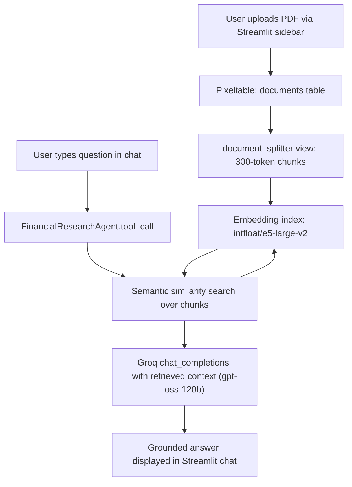

# Financial Research Assistant (Equity Research Agent)

[](https://www.python.org/)
[](https://streamlit.io/)
[](https://github.com/pixeltable/pixeltable)
[](https://groq.com/)
[](LICENSE)

An intelligent Retrieval-Augmented Generation (RAG) assistant designed for equity research, FP&A workflows, and financial document analysis. Drop in financial reports (10-Ks, 10-Qs, earnings call transcripts, or equity research notes) as PDFs and immediately ask natural language questions about valuation assumptions, revenue drivers, capital expenditures, margins, and guidance.

All answers are strictly grounded in retrieved document chunks with zero hallucination.

---

## Architecture Overview

The system combines an embedded vector store and compute orchestrator ([Pixeltable](https://github.com/pixeltable/pixeltable)) with local vector embeddings ([`intfloat/e5-large-v2`](https://huggingface.co/intfloat/e5-large-v2)) and ultra-fast LLM inference hosted on [Groq](https://groq.com/) (`openai/gpt-oss-120b`).



### Key Highlights
- **Zero-Manual Chunking / Indexing Pipeline**: Pixeltable views automatically split uploaded PDFs into 300-token chunks and maintain vector embedding indexes declaratively.
- **Strict Grounding & Auditability**: The agent strictly answers from retrieved chunks and alerts the user if the document does not contain sufficient information.
- **Embedded & Self-Contained**: Runs against an embedded PostgreSQL instance (`pixeltable_pgserver`) — no external hosted vector database subscription required.
- **Offline Embedding Support**: Embeddings run locally via `sentence-transformers`, caching weights so subsequent runs require no Hugging Face network requests.
- **Secondary Vector Store Export**: Includes an exploratory notebook demonstrating exporting conversation memory and vectors to [LanceDB](https://lancedb.com/).

---

## Tech Stack

| Component | Technology / Model | Role |
|---|---|---|
| **Architecture** | RAG (Retrieval-Augmented Generation) | Context retrieval and grounded generation |
| **Frontend** | Streamlit | Clean, interactive chat and PDF upload interface |
| **Vector DB / Orchestration** | Pixeltable | Embedded Postgres storage, computed views, vector search |
| **Agent Framework** | `pixelagent` & OpenAI SDK | Agent orchestration and Groq API communication |
| **LLM** | `openai/gpt-oss-120b` (via Groq API) | Reasoning and document synthesis |
| **Embeddings** | `intfloat/e5-large-v2` | Dense semantic chunk representation via `sentence-transformers` |
| **Chunking** | Pixeltable `document_splitter` | Token-based document chunking (300-token limit) |
| **Secondary Vector DB** | LanceDB | Fast on-disk vector memory export demonstrated in demo notebook |

---

## Project Structure

```
context-pipeline/
├── app.py                     # Streamlit chat interface (main application entry point)
├── tools.py                   # financial_tool — Pixeltable vector similarity search query
├── pipeline.ipynb              # One-time schema setup, document ingestion, & exploratory demo
├── requirements.txt           # Python dependencies
├── PRD.md                     # Product Requirements Document & technical specification
├── LICENSE                    # MIT License
├── .streamlit/
│   ├── secrets.toml           # Groq API credentials (ignored by git)
│   └── secrets.toml.example   # Example secrets template
└── README.md                  # Project documentation
```

---

## Getting Started

### Prerequisites
- Python 3.10 to 3.13
- A Groq API key (sign up at [console.groq.com](https://console.groq.com/keys))

### 1. Clone the Repository
```bash
git clone https://github.com/<your-username>/context-pipeline.git
cd context-pipeline
```

### 2. Create and Activate a Virtual Environment
```bash
# On macOS / Linux:
python3 -m venv .venv
source .venv/bin/activate

# On Windows (PowerShell):
python -m venv .venv
.venv\Scripts\Activate.ps1
```

### 3. Install Dependencies
```bash
pip install -r requirements.txt
```

### 4. Configure API Secrets
Create a `.streamlit/secrets.toml` file from the provided example template:

```bash
cp .streamlit/secrets.toml.example .streamlit/secrets.toml
```

Open `.streamlit/secrets.toml` and add your Groq API key:
```toml
GROQ_API_KEY = "gsk_your_actual_groq_api_key"
```

### 5. Initialize Database Schema & Demo Data
Before running the Streamlit app for the first time, execute `pipeline.ipynb` to establish the Pixeltable directory, document tables, chunking views, and the embedding index:

```bash
jupyter notebook pipeline.ipynb
```
*Run all cells sequentially in the notebook. This downloads sample financial reports, builds the embedding index, and validates vector search.*

### 6. Launch the Streamlit App
Start the interactive application:
```bash
streamlit run app.py
```

Navigate to `http://localhost:8501` in your browser.

---

## Usage

1. **Upload a Report**: Drag and drop any financial PDF into the left sidebar (e.g., Apple 10-K, Alphabet Earnings Release, Equity Research Note).
2. **Automatic Indexing**: Pixeltable validates that the file is not already ingested, parses text, chunks into 300 tokens, and calculates `e5-large-v2` embeddings.
3. **Ask Financial Questions**:
   - *"What are the core valuation assumptions used in the DCF?"*
   - *"Summarize management commentary on operating margins for the upcoming fiscal year."*
   - *"What are the main risks highlighted in the report?"*
4. **Grounded Answers**: The agent retrieves the top matching chunks and formats a precise, corporate-toned equity research response.

---

## Technical Considerations & Known Limitations

- **Reasoning Model Response Handling**: `gpt-oss-120b` is an advanced reasoning model. Occasionally under certain parameter settings, reasoning tokens may fill without yielding text in `message.content`. `app.py` includes defensive exception handling to prevent application crashes and prompt the user to re-ask.
- **Shared Ingestion Pool**: Chunks accumulate in `context_engineering.document_chunks`. Vector similarity search queries the entire ingested document set; multi-document sessions will match the most semantically relevant chunk across all uploaded files.
- **Embedded Database**: Pixeltable leverages an embedded PostgreSQL database (`pixeltable_pgserver`) designed for local single-user execution.

---

## Roadmap

- [ ] Per-document / per-session retrieval filtering.
- [ ] Direct citation UI component linking answers to exact PDF pages and highlighted source chunks.
- [ ] Sidebar control to clear or reset the active document pool without notebook execution.
- [ ] Integration of lighter-weight non-reasoning fallback models for faster simple lookups.

---

## License

Distributed under the [MIT License](LICENSE). See `LICENSE` for more information.
